# 📽4Seasons Movie

> Movie Recommendation Service

[TOC]

## 🤷‍♂️무슨 프로젝트에요?

> 날씨가 왜 이렇게 춥지? 벌써 겨울이라고?

바야흐로 OTT시대라고 할 정도로 OTT 서비스가 유행입니다. 넷플릭스, 티빙, 왓챠, 디즈니플러스까지.. 쏟아져나오는 영화추천 사이트 속에서 그들과는 다른 차별화된 감성의 서비스를 제공하고 싶었습니다. 대부분 OTT 서비스는 검은색 계통의 어두운 배경을 갖고, 여러가지 영화추천 리스트만 제공합니다. 하지만 우리는 반복되는 일상에 지친 직장인들이 퇴근길이나 집에서 사이트를 접하기만 해도 힐링이 되면 좋겠다고 생각했고, 영화를 본 뒤에는 영화에 대해 와글와글 떠들 수 있는 공간을 제공하고 싶었습니다. 그래서 탄생한 사계절 컨셉의 영화추천 웹 서비스, 4Seasons입니다.

## 🎯주요 타겟은 누구죠?

> Persona - 사회 초년생 승원(27, 입사 6개월 차)

사회 초년생 27세 승원 씨, 도심 속에서 잊고 살았던 계절을 영화를 통해 되찾다.

지친 퇴근길, 길을 걷다 하늘을 보게 된 승원은 생각했다. '언제 단풍이 들었지?'

웹페이지를 통해 잊었던 새로운 계절의 설렘과 좋아하는 영화 정보를 얻다.

## 🤝누구랑 하셨어요?

- 공동진행

  - Figma를 활용한 웹서비스 디자인 작업
  - Vuex를 활용한 BackEnd데이터 변수할당 및 출력
  - CSS를 활용한 UI 개선
- 남정현(팀장)

  - 데일리 스크럼 진행 및 일별 계획수립
  - BackEnd - 리뷰 작성/수정/삭제, 댓글 작성 기능 구현
  - FrontEnd - 커뮤니티, 로그인, 홈인덱스 페이지 구현
- 서승원

  - BackEnd - API를 활용한 json파일 생성 및 DB구축, 모델링
  - FrontEnd - 영화추천페이지, 영화디테일 페이지 구현
- 오장훈

  - BackEnd - 음식과 장르를 연결한 게임 알고리즘 개발
  - FrontEnd - 서비스소개, 게임플레이 페이지 구현 

## ✔간단한 사이트 소개 해주세요

사계절로 나뉘어지는 디자인 페이지

- Home - Service intro
- HomeIndex - 계절 서비스 간략 소개
- 봄 - 우리의 목표
- 여름 - 영화 추천 메인페이지

  - 현재 계절에 맞는 영화 추천 (사용자의 접속시간 활용)
  - 인기순 영화 추천 (인기도 종합지표 활용)
  - 평점순 영화 추천 (평균평점 데이터 활용)
  - 최신 개봉 영화 추천 (개봉일 데이터 활용)
- 가을 - 음식 취향 테스트로 보는 영화 취향 테스트

  - 사용자가 플레이한 게임결과에 맞는 영화 추천 (게임데이터와 장르 연결)
- 겨울 - 커뮤니티

  - 영화리뷰, 댓글 모음

## 1. 개발환경

### 1.1 Languages / Framework

- Languages
  - Python
  - JavaScript
- Framework
  - Vue.js : Front-End
  - DRF : Back-End

### 1.2 Tools

- Tools
  - Visual Studio Code
  - Chrome Browser
  - Postman
  - Figma
  - Draw.io
  - Notion

### 1.3 Data Reference

- TMDB API

## 2. ERD 및 Vue Component

### 2.1 ERD

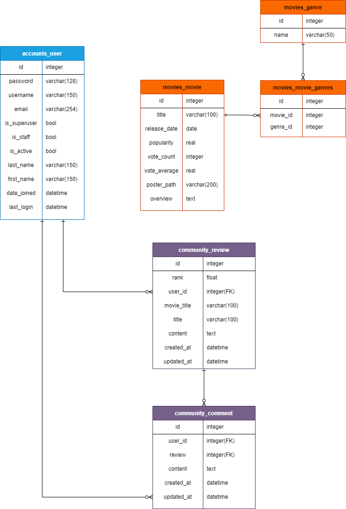

accounts 내의 user / movie내의 movie, genre / community내의 review, comment를 구성하고

각각의 관계를 다음 ERD의 상태로 연결함.

### 2.2 Vue Component

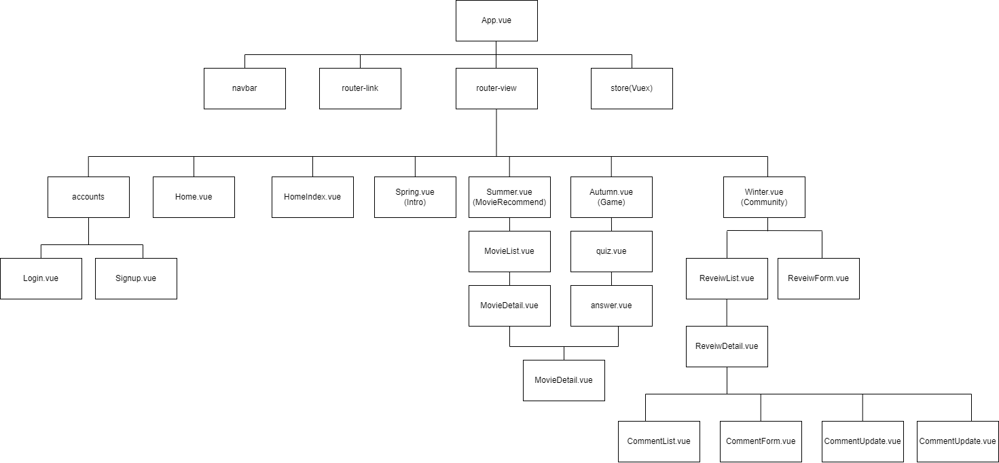

Front를 Vue로 구성하며 기능별 컴포넌트를 세분화 하여 표현. 각 계절 별 메인 기능을 중심으로 하위 컴포넌트를 구성함. Vuex를 통해 커뮤니티 오브젝트를 효율적으로 관리함

Movie의 경우 각 Vue 컴포넌트내에서 주로 다루며 부모-자식 컴포넌트의 상속을 통해 처리.

## 3. 목표 서비스 설명 및 세부 기능 소개

### 3.1 Design

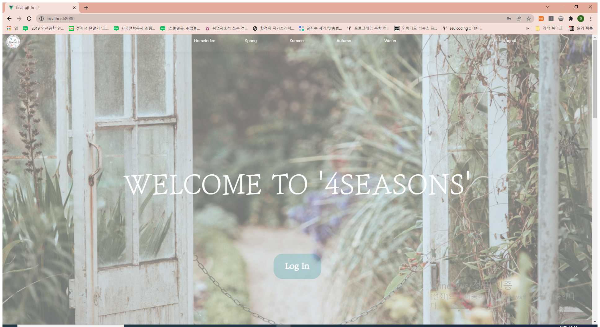

각 기능을 수행하는 페이지를 계절과 연계하여 계절감을 드러내도록 작성하였다.

계절의 색감을 매칭시켜 그 계절에 연상되면서 동시에 사람들이 편안함을 느낄 수 있는 눈에 편안한 색을 제공하여 컨텐츠를 부각시키면서 계절감을 드러낼 수 있도록 작성하였으며, 필요에 따라 그라데이션을 통해 점진적인 계절의 변화를 보여주도록 작성하였음.

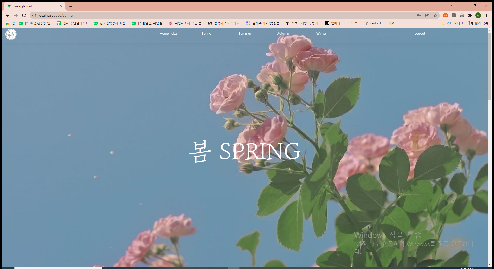

각 계절은 계절에 걸맞는 메인 사진을 중심으로 세부적인 디자인을 통해 계절감을 더했다. 또한 페이지 전환과 알맞는 글씨를 통해 디자인 적인 부분을 중심적으로 작성

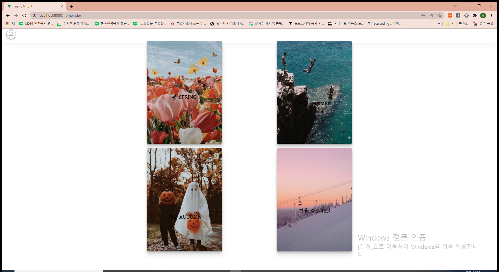

navbar와 더불어 Index페이지에서 이동기능을 작성

### 3.2 영화 추천 및 영화 정보 제공

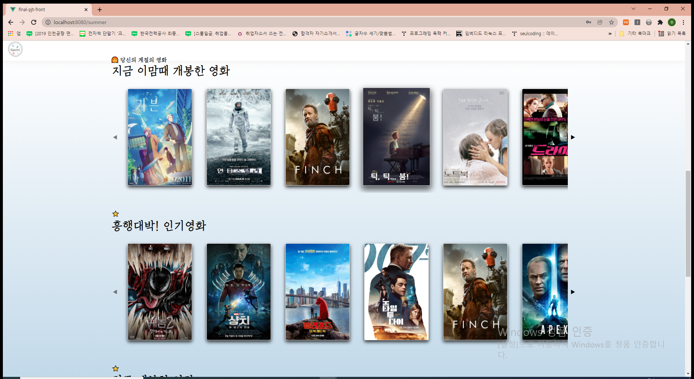

- 현재 계절에 맞는 영화 추천 (사용자의 접속시간 활용)
- 인기순 영화 추천 (인기도 종합지표 활용)
- 평점순 영화 추천 (평균평점 데이터 활용)
- 최신 개봉 영화 추천 (개봉일 데이터 활용)
- 각 영화의 세부 정보 역시 제공.

### 3.3 취향 테스트

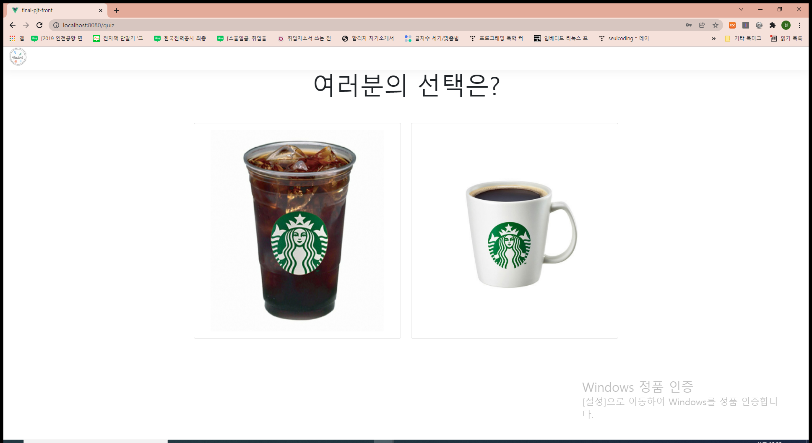

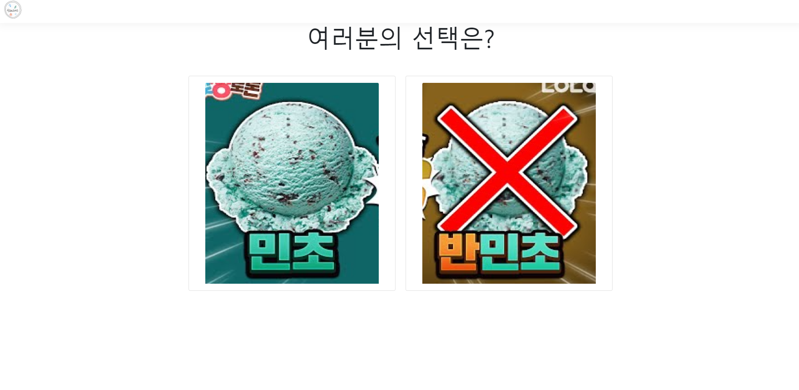

- 모든 선택지를 고르면 다음과 같은 화면이 출력된다.

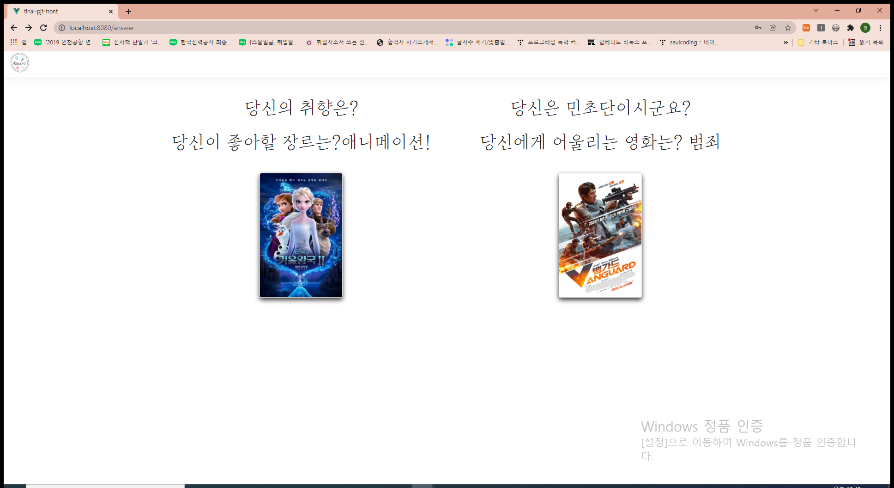

- 사용자가 플레이한 게임결과에 맞는 영화 추천 (게임데이터와 장르 연결)

### 3.4 커뮤니티

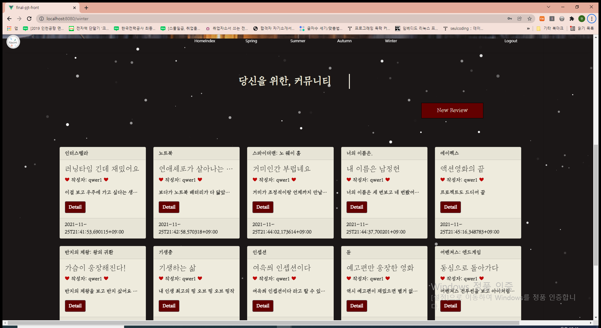

리뷰를 작성, 수정, 삭제 가능하며 각 리뷰의 상세정보에서 댓글을 작성하고 삭제할 수 있는 기능을 구현

### 3.5 로그인

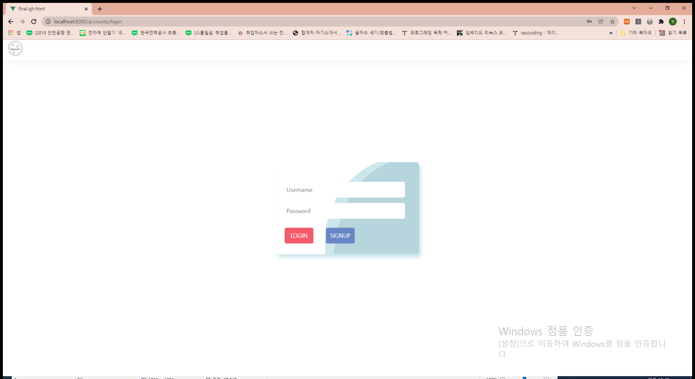

전체 페이지는 로그인(인증) 된 작성자에게만 컨텐츠를 노출하도록 작성하였으며 로그인과 회원가입기능은 백엔드로 구현하였고 이를 JWT와 Axios를 통해 프론트에서 사용할 수 있도록 설정함.

## 4. 느낀 점📚🙋‍♂️

프로젝트를 수행하지 않고 이론만 학습할 때와는 차원이 다른 학습수준을 경험할 수 있었다. 프론트엔드와 백엔드 역할을 이해할 수 있었고, 사용자들은 어떤 정보를 원할지, 어떤 서비스를 제공해야 재미있게 사이트를 즐길 수 있을지를 고민하며 사용자 친화적인 서비스를 제공하고자 노력했다. 물론 쉽지 않았다. 원하는 기능은 넘쳐났고 데드라인은 다가오니 처음에 계획했던 기능의 일부를 삭제해야만 했지만 이 또한 MVP를 빠른 시간 내에 출시하는 데 도움이 되었다.

처음에 세웠던 원칙. 자유롭게 반대의견 내고 서운한 점 있으면 그날 털고 가자. 이 두가지를 지켜서 프로젝트를 진행하니 분위기가 너무 좋았고 재밌게 진행할 수 있었다. Django와 Vue.js를 이용해 프로젝트를 진행해 보았으니 다음엔 Spring과 React로 새로운 서비스를 제작하고자 하는 욕심이 난다. 물론 그러기 위해서는 엄청난 노력을 해야겠지? 특히 이번 프로젝트를 진행하며 모르는 것을 구글링해서 찾아보고/공부해서/적용시키는 3단계를 거치는 경우가 굉장히 많았는데 이 3단계를 자주 접하다 보니 새로운 것을 습득하는 능력이 생긴 것 같아 뿌듯했다. 뭐든지 배울 수 있다는 자신감도 생긴듯하다ㅎㅎ

여기서 멈추지 말고 결과물을 분석하고 부족한 점을 보완해서, 다음 PJT 때는 초기에 계획했던 기능을 최대한 구현할 수 있도록 해야지. 화이팅!!
